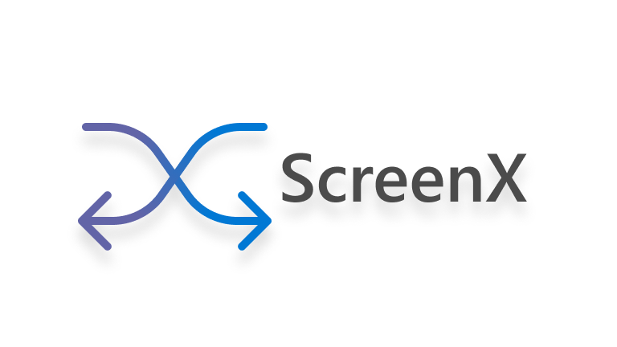
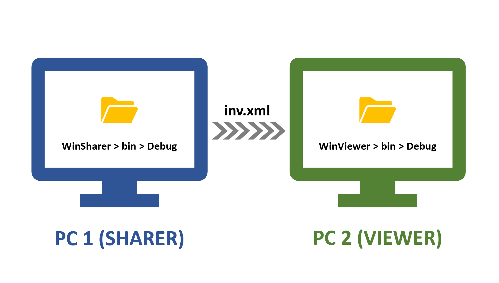
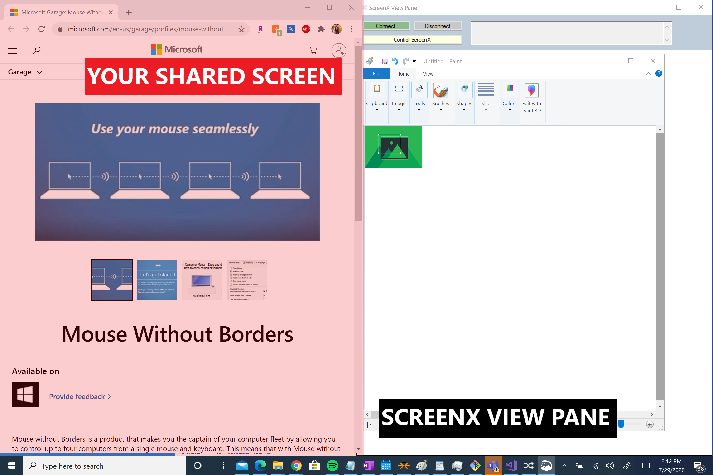

A true cross-team cross-platform collaboration app, developed as a part of the 2020 Microsoft Hackathon. This is our latest working prototype.

## What is ScreenX?

As universities and workplace environments shift towards a virtual world, it is our goal to leverage Microsoft Teams to create a collaboration tool that promotes unprecedented teamwork. 

 

ScreenX (pronounced "Screen Cross") is a Teams extension that will allow two users to view and interact with each other’s screen simultaneously in a remote environment. As an example, let’s say Lucy is a Teaching Assistant at Microsoft University and is tutoring Rob because he's having trouble with a specific question. Using our feature, Rob can watch Lucy navigate relevant course material as Lucy watches Rob working through the assignment. In this scenario, ScreenX creates an uninterrupted, interpersonal classroom setting by eliminating the pain of alternating screen shares. 

 

Lucy's activities can range from copying and pasting text or files on either PC to drawing directly on Rob’s OneNote for safe note-keeping. With access to both PCs, sharing links or files becomes seamless. Outside of a collaboration in an educational or workplace setting, we also believe this product will create a new wave of social activities such as collaborative online shopping or trip planning. We like to call it a new wave of “Social Surfing”. In these unparalleled times, our team wanted to focus on building technology that promotes synergy, camaraderie, and harmony by bringing us closer than ever before. 

## Limitations

This ScreenX prototype supports the following operating systems: Windows 10, Windows 7, Windows 8, Windows 8.1, Windows Server 2003, Windows Server 2008, Windows Server 2012, and Windows Server 2016. Furthermore, ScreenX is currently only operable on 2 machines wherein both machines are linked to the same wired/wireless network. We will continue work to enable ScreenX on two machines connected to the same VPN network.

## Getting Started
#### Installation & Setup

1. Double check to ensure that both PCs that will run ScreenX are on the same wireless/wired network and that neither PC is running on a VPN.

2. Head to https://www.microsoft.com/en-us/download/details.aspx?id=35460 to download Mouse Without Borders, a Microsoft Garage project by Truong Do, on both ScreenX PCs. Follow the installation and setup instructions, and enable the Mouse Without Borders connection.

3. Download or clone this repository to both local machines.

4. The following steps are broken down into "sharer" and "viewer" steps. Please note that each PC will host one Share Pane (to share its own application) and one View Pane (to view the other PC's application) for the full ScreenX experience; hence, each PC will take a turn walking through the "sharer" and "viewer" steps.

#### PC 1: Sharer
5. Prior to launching the Share Pane, make sure that the application you would like to share is open and visible on your PC screen.

6. Inside the ScreenX repository, navigate to WinSharer->bin->Debug. Double click on the file named "WinSharer.exe". This will launch the ScreenX Share Pane application.

7. Select the application you want to share in the dropdown menu, then click "Begin ScreenX Share". You will see a note in the dialog box that you have begun sharing the application you selected.

8. Navigate back to your File Explorer and in the Debug folder, open the file named "inv.xml" with NotePad or WordPad. (Hint: right click on the file and select Edit in the menu.)

9. Copy the contents of the inv.xml file into your shared Mouse Without Borders clipboard using CTRL+C.

#### PC 2: Viewer
10. Inside the ScreenX repository, navigate to WinViewer->bin->Debug. Open the file named "inv.xml" with NotePad or WordPad. (Hint: right click on the file and select Edit in the menu.)

11. Delete the contents in the inv.xml file, and use CTRL+V to paste the contents of your shared Mouse Without Borders clipboard. Save the file and exit.

12. Navigate back to your File Explorer and in the Debug folder, double click on the file named "WinViewer.exe". This will launch the ScreenX View Pane application.

13. In the ScreenX View Pane application, click the Connect button. After a moment, you will begin to see the application shared by your ScreenX companion PC.

#### Finishing Up
10. Repeat steps 5-13 on the other PC to establish two remote sessions on each machine, with one Share Pane and one View Pane each. Congratulations, you now have a working ScreenX setup!

11. In order to take control of your companion's shared application, click the Control ScreenX in the ScreenX View Pane. Alternatively, for a smoother experience, you can also move your mouse off your screen and onto your companion's screen to take advantage of Mouse Without Border's capabilities. Through the ScreenX View Pane, you will be able to see your mouse on your companion's shared application to perform actions on that application.

12. To copy and paste text, images, and files, move your mouse onto your companion's shared application and copy to clipboard. Simply navigate your mouse back to your screen to paste in your own application.

## Troubleshooting and FAQs
#### My ScreenX View Pane is failing to connect!
If your ScreenX View Pane is displaying a connection error in the dialog box in the upper right corner:
- Double check to ensure you have copied and saved the exact contents of the inv.xml file from your companion PC's ScreenX Share Pane folder. You can alternatively paste the contents of the inv.xml file from the Share Pane into a messaging application in case the Mouse Without Borders shared clipboard is inoperable.
- Open both PC's WiFi settings and ensure that they match. You should also verify that neither PC is connected to a VPN.

#### I can only see part of my companion's shared application!
The application that is being shared must be in the foreground on the sharer's screen. Ensure that no other app is open on top of the shared application. Additionally, we recommend setting up the shared application on the left half of the sharer's screen and the ScreenX View Pane on the right half of the screen. Due to variations in sizing and resolution on laptops and PCs, keeping your shared application on the left half of your screen will ensure that your ScreenX companion can see your actions at all times.

